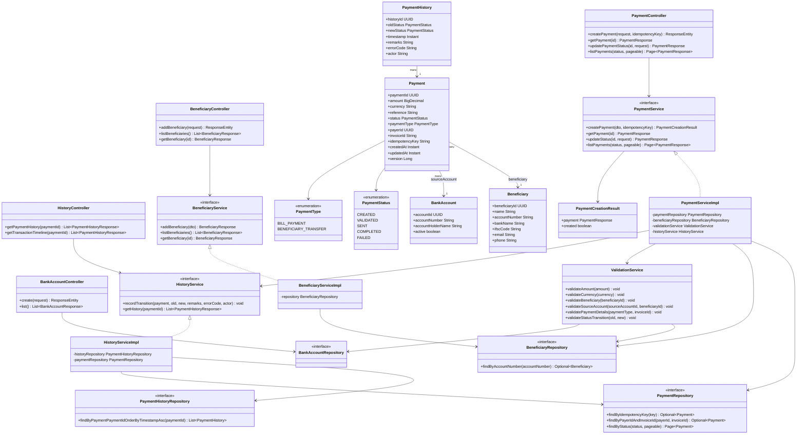
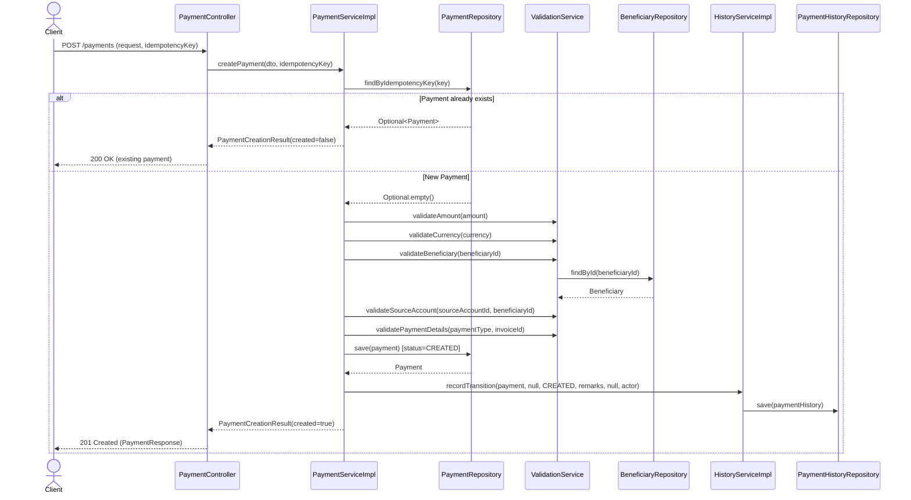
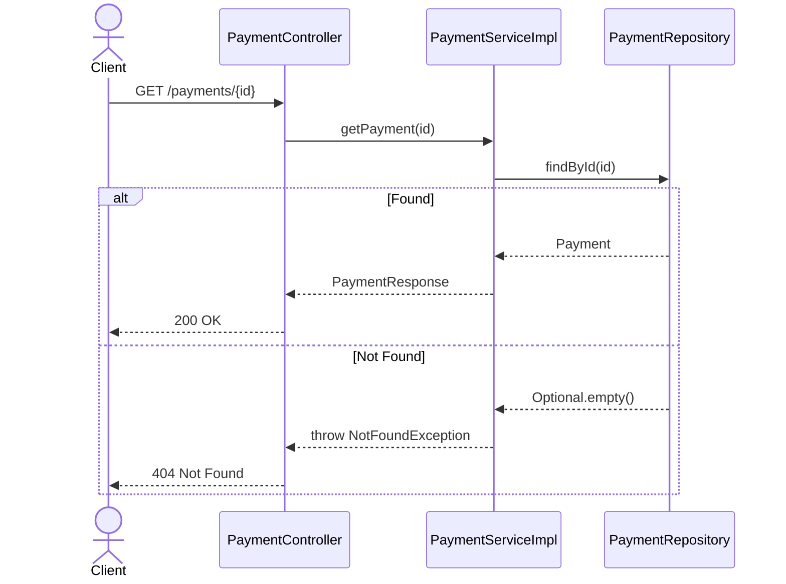
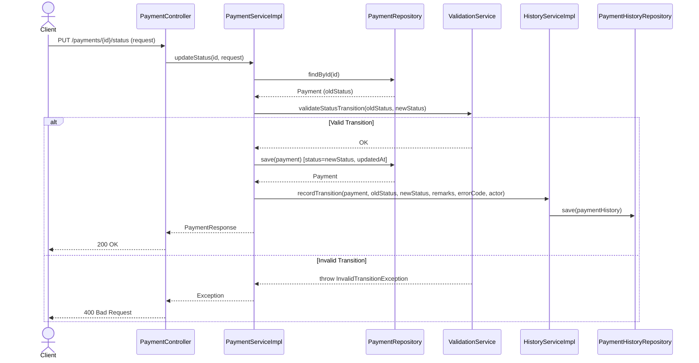
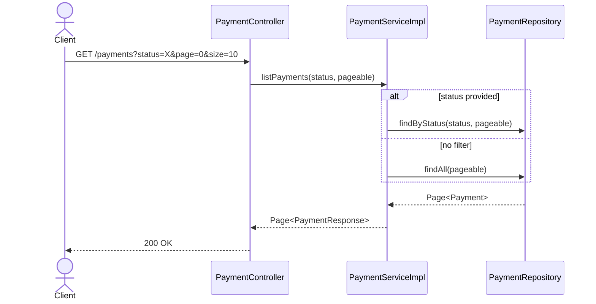
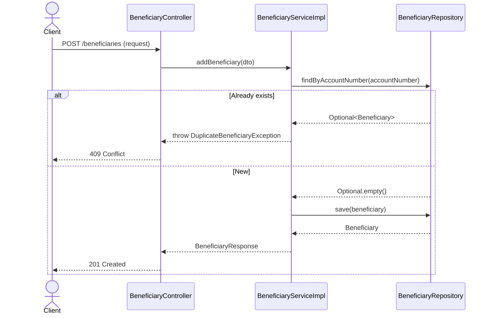
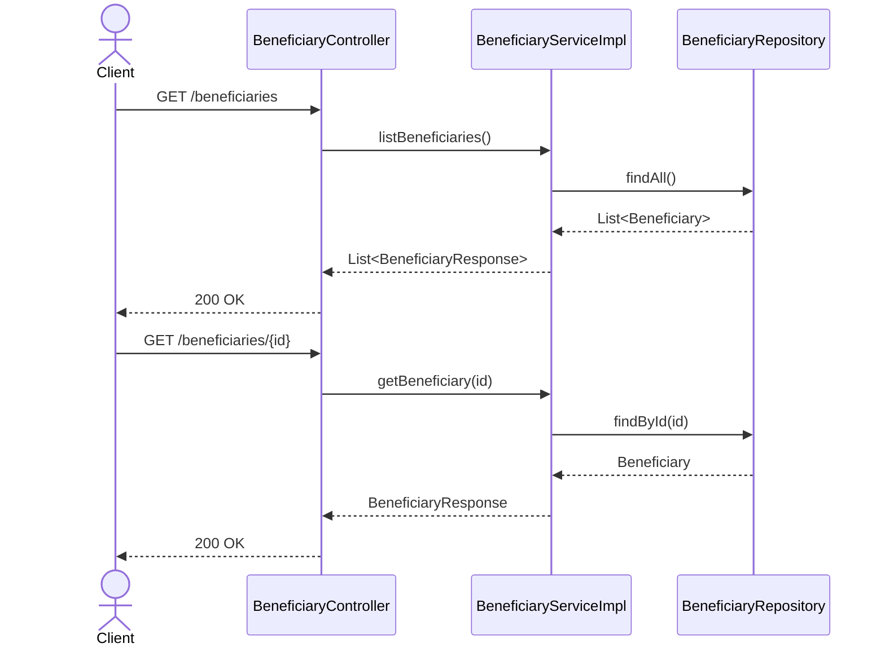
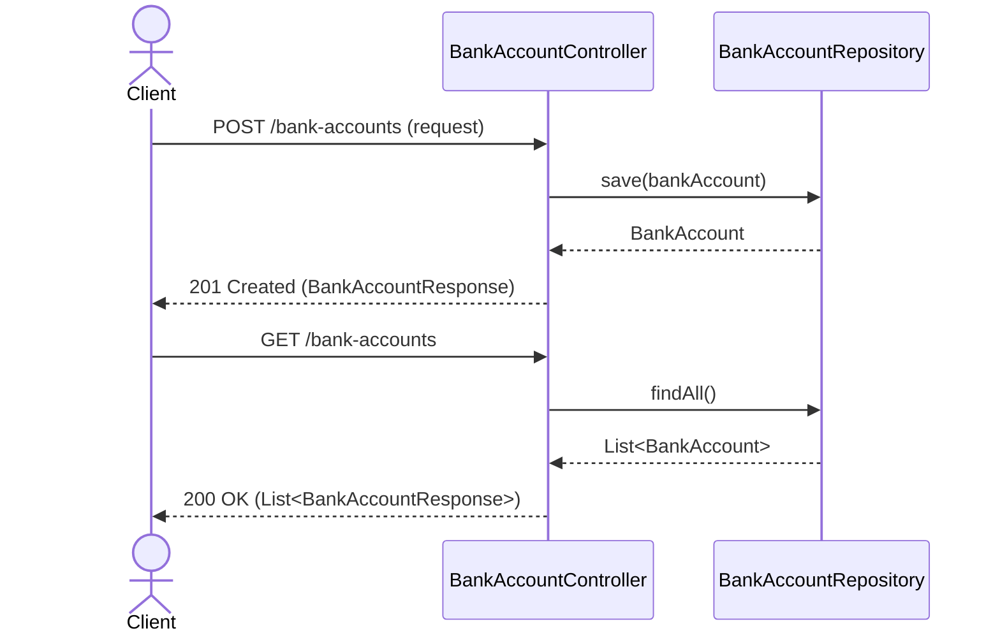
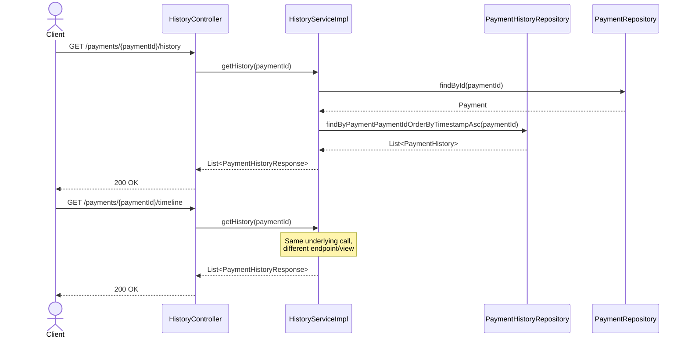

# Payment Processing System

## Overview
This project defines a payment processing system that supports multiple payment channels, prevents duplicate payments, validates transactions, handles failures reliably, and provides a simple shared interface for single user.

## Run After Folder Restructure

All backend commands should be run from the `backend` folder.

### Windows PowerShell

```powershell
cd backend
.\mvnw.cmd clean package -DskipTests
.\mvnw.cmd spring-boot:run
```

### Docker

```powershell
cd backend
docker-compose up --build
```

## Meeting Notes for 30-07-2026
Multiple payment channels need to be supported, including UPI, Card Payments, and NetBanking.

To avoid duplicate payments, the system should check whether the user is attempting to pay for the same invoice more than once.

Various validation rules were discussed to ensure secure and error‑free transactions.

A clear solution for handling payment failures is required, including user notifications and retry options.

The system will have a single user interface, but it must support multiple end users simultaneously.

The interface should be simple, intuitive, and ready to use, ensuring a smooth user experience.

<br>
<br>
------------------------------------------------------------------------------

# Payment Service - Visual Diagrams & Architecture

Spring Boot based Payment Service supporting payment creation (idempotent), status transitions, beneficiary management, bank account management, and full transaction history/audit trail.

## Table of Contents
- [Class Diagram](#class-diagram)
- [Sequence Diagrams](#sequence-diagrams)
  - [1. Create Payment (Idempotent)](#1-create-payment-idempotent)
  - [2. Get Payment by ID](#2-get-payment-by-id)
  - [3. Update Payment Status](#3-update-payment-status)
  - [4. List Payments (filter + pagination)](#4-list-payments-filter--pagination)
  - [5. Add Beneficiary](#5-add-beneficiary)
  - [6. List / Get Beneficiary](#6-list--get-beneficiary)
  - [7. Create / List Bank Account](#7-create--list-bank-account)
  - [8. Get Payment History / Transaction Timeline](#8-get-payment-history--transaction-timeline)

---

## Class Diagram



---

## Sequence Diagrams

### 1. Create Payment (Idempotent)



### 2. Get Payment by ID



### 3. Update Payment Status



### 4. List Payments (filter + pagination)



### 5. Add Beneficiary



### 6. List / Get Beneficiary



### 7. Create / List Bank Account



### 8. Get Payment History / Transaction Timeline



---

## Notes
- All sequence diagrams follow the exact method signatures and dependencies defined in the class diagram.
- `HistoryServiceImpl` is invoked internally by `PaymentServiceImpl` to record transitions during payment creation and status updates.
- `ValidationService` performs no persistence of its own; it only reads from `BeneficiaryRepository` and `BankAccountRepository` for validation checks.
