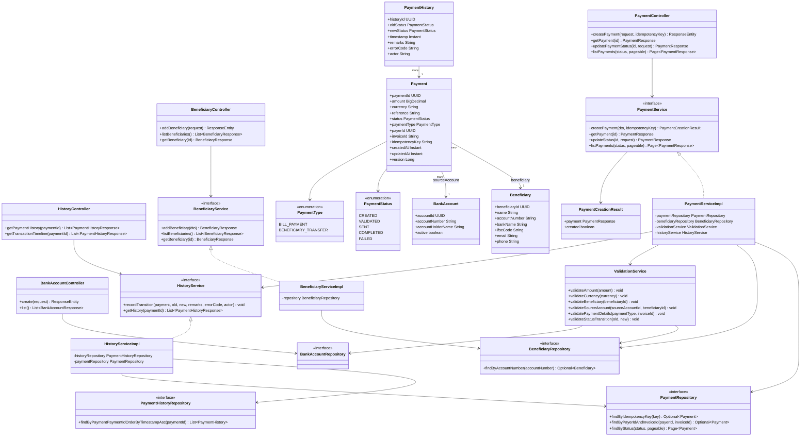
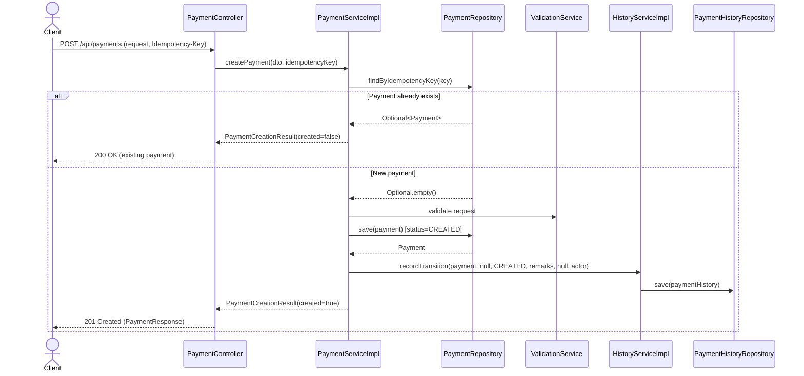
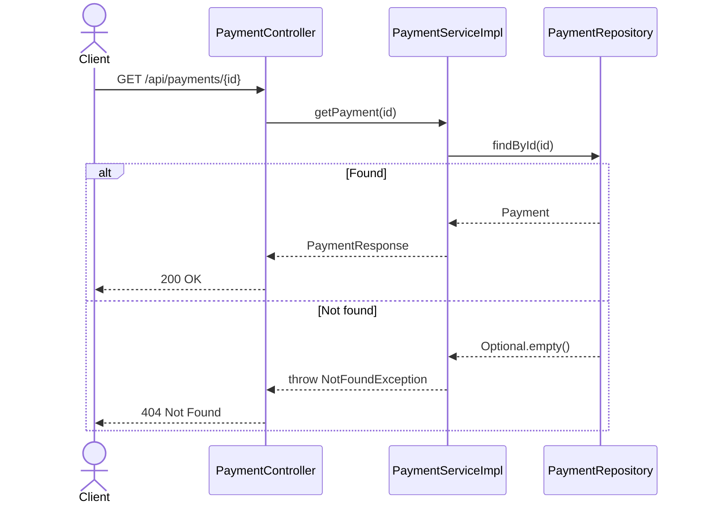
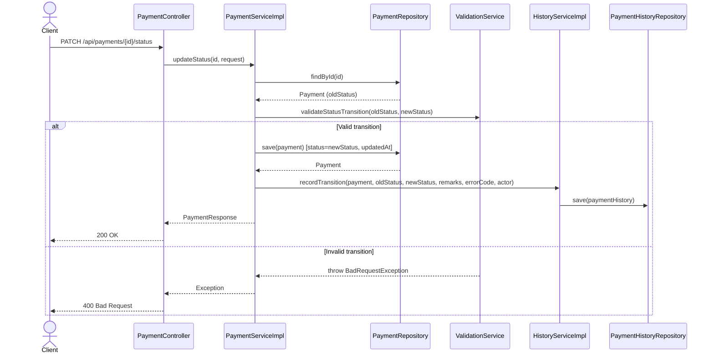
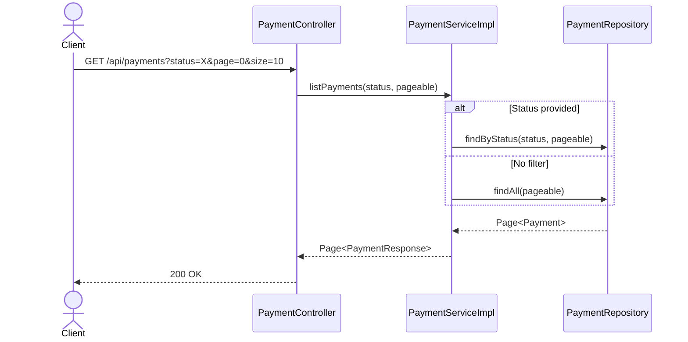
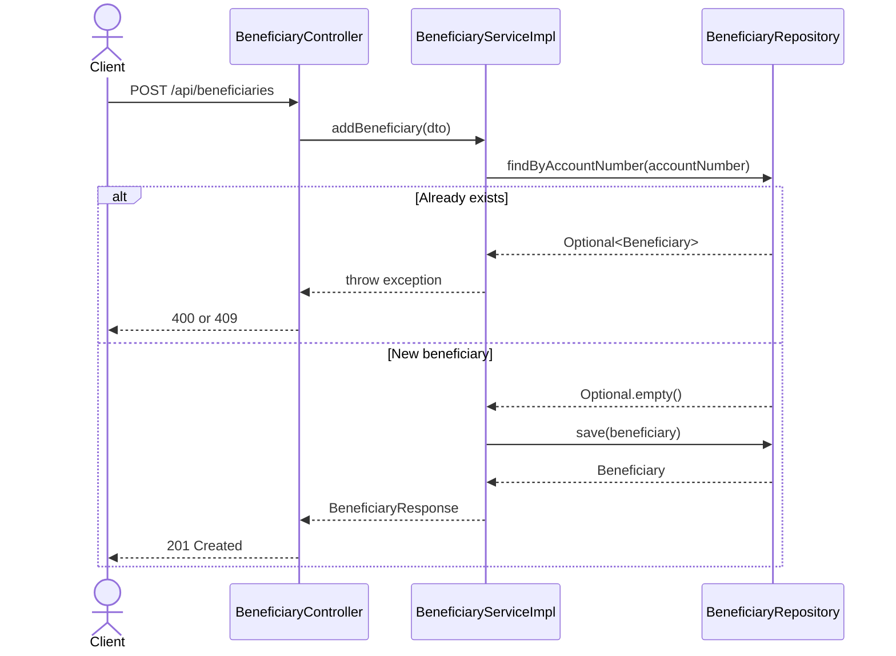
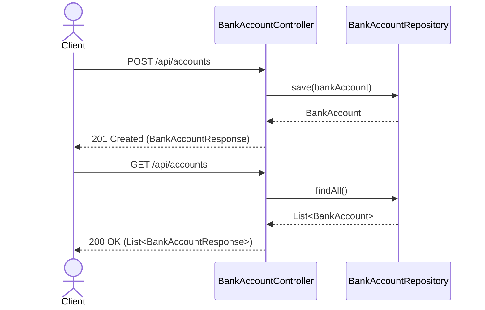
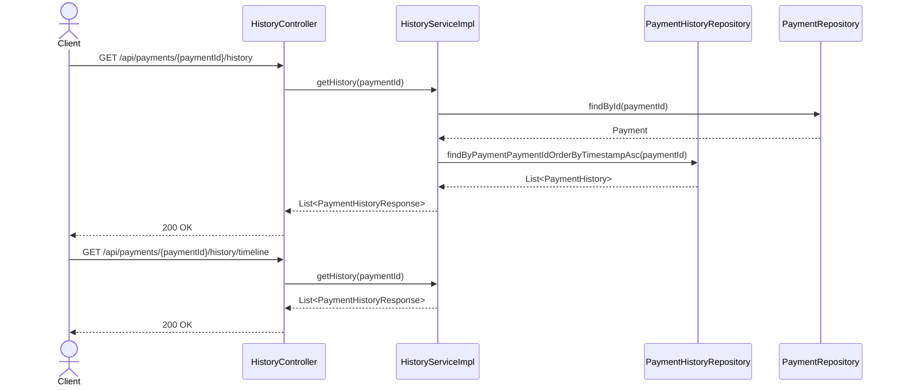

<a id="top"></a>

# Payment Processing System

## Overview

This Spring Boot service handles outgoing and incoming payments, beneficiary management, bank account management, idempotent payment creation, payment status transitions, and payment history tracking.

## Quick Navigation

- [Run Locally](#run-locally)
- [API Conventions](#api-conventions)
- [API Reference](#api-reference)
- [Payments](#payments)
- [Beneficiaries](#beneficiaries)
- [Bank Accounts](#bank-accounts)
- [Payment History](#payment-history)
- [Incoming Payments](#incoming-payments)
- [Current User](#current-user)
- [Architecture Diagrams](#architecture-diagrams)
- [Notes](#notes)

## Run Locally

All backend commands should be run from the `backend` folder.

### Windows PowerShell

```powershell
cd backend
.\mvnw.cmd clean package -DskipTests
.\mvnw.cmd spring-boot:run
```

### Docker

```powershell
cd backend
docker-compose up --build
```

<a id="api-conventions"></a>

## API Conventions

- Base path: `/api`
- Content type: `application/json`
- Payment creation requires the `Idempotency-Key` header.
- Common currencies accepted by payment validation: `INR`, `USD`, `EUR`, `GBP`
- Payment methods: `CARD`, `NET_BANKING`, `UPI`
- Payment types: `BILL_PAYMENT`, `BENEFICIARY_TRANSFER`
- Payment statuses: `CREATED`, `VALIDATED`, `SENT`, `COMPLETED`, `FAILED`
- Bank account types: `SAVINGS`, `CURRENT`, `SALARY`

### Standard error response

```json
{
  "timestamp": "2026-08-06T09:12:45.240Z",
  "status": 400,
  "errorCode": "VALIDATION_FAILED",
  "message": "currency: must not be blank"
}
```

<a id="api-reference"></a>

## API Reference

Each title below is clickable and expands to the endpoint details.

<a id="payments"></a>
<details open>
<summary><strong>Payments</strong></summary>

### POST /api/payments

Creates a payment. If the same `Idempotency-Key` is reused, the API returns the original payment instead of creating a duplicate.

**Headers**

```http
Idempotency-Key: pay-20260806-001
Content-Type: application/json
```

**Example request: net banking transfer**

```json
{
  "amount": 2500.75,
  "currency": "INR",
  "reference": "Rent for August",
  "payerId": "11111111-1111-1111-1111-111111111111",
  "paymentMethod": "NET_BANKING",
  "sourceAccountId": "22222222-2222-2222-2222-222222222222",
  "beneficiaryId": "33333333-3333-3333-3333-333333333333",
  "paymentType": "BENEFICIARY_TRANSFER",
  "invoiceId": null
}
```

**Example request: card payment**

```json
{
  "amount": 1499.00,
  "currency": "INR",
  "reference": "Utility bill",
  "payerId": "11111111-1111-1111-1111-111111111111",
  "paymentMethod": "CARD",
  "cardType": "CREDIT_CARD",
  "cardHolderName": "Aarav Sharma",
  "cardNumber": "4111111111111111",
  "expiryMonth": "12",
  "expiryYear": "2030",
  "cvv": "123",
  "paymentType": "BILL_PAYMENT",
  "invoiceId": "INV-2026-1001"
}
```

**Example request: UPI payment**

```json
{
  "amount": 899.99,
  "currency": "INR",
  "reference": "Mobile recharge",
  "payerId": "11111111-1111-1111-1111-111111111111",
  "paymentMethod": "UPI",
  "upiId": "aarav.sharma@upi",
  "paymentType": "BILL_PAYMENT",
  "invoiceId": "INV-2026-1002"
}
```

**201 Created response**

```json
{
  "paymentId": "44444444-4444-4444-4444-444444444444",
  "amount": 2500.75,
  "currency": "INR",
  "reference": "Rent for August",
  "status": "CREATED",
  "paymentType": "BENEFICIARY_TRANSFER",
  "paymentMethod": "NET_BANKING",
  "cardType": null,
  "payerId": "11111111-1111-1111-1111-111111111111",
  "invoiceId": null,
  "sourceAccountId": "22222222-2222-2222-2222-222222222222",
  "beneficiaryId": "33333333-3333-3333-3333-333333333333",
  "cardLast4": null,
  "cardHolderName": null,
  "upiId": null,
  "createdAt": "2026-08-06T09:15:22.310Z",
  "updatedAt": "2026-08-06T09:15:22.310Z"
}
```

**200 OK response for reused idempotency key**

Returns the same shape as the `201 Created` response.

**Notes**

- `NET_BANKING` requires `beneficiaryId` and `sourceAccountId`.
- `UPI` requires `upiId` and must not include card fields or `beneficiaryId`.
- `CARD` requires `cardType`, `cardHolderName`, `cardNumber`, `expiryMonth`, `expiryYear`, and `cvv`.
- `BILL_PAYMENT` requires `invoiceId`.
- `BENEFICIARY_TRANSFER` must not include `invoiceId`.

### GET /api/payments/{id}

Returns one payment by ID.

**200 OK response**

```json
{
  "paymentId": "44444444-4444-4444-4444-444444444444",
  "amount": 2500.75,
  "currency": "INR",
  "reference": "Rent for August",
  "status": "CREATED",
  "paymentType": "BENEFICIARY_TRANSFER",
  "paymentMethod": "NET_BANKING",
  "cardType": null,
  "payerId": "11111111-1111-1111-1111-111111111111",
  "invoiceId": null,
  "sourceAccountId": "22222222-2222-2222-2222-222222222222",
  "beneficiaryId": "33333333-3333-3333-3333-333333333333",
  "cardLast4": null,
  "cardHolderName": null,
  "upiId": null,
  "createdAt": "2026-08-06T09:15:22.310Z",
  "updatedAt": "2026-08-06T09:15:22.310Z"
}
```

### PATCH /api/payments/{id}/status

Moves a payment through the supported status workflow.

**Example request**

```json
{
  "status": "VALIDATED",
  "remarks": "Payment validated by workflow engine",
  "errorCode": null,
  "actor": "SYSTEM"
}
```

**200 OK response**

```json
{
  "paymentId": "44444444-4444-4444-4444-444444444444",
  "amount": 2500.75,
  "currency": "INR",
  "reference": "Rent for August",
  "status": "VALIDATED",
  "paymentType": "BENEFICIARY_TRANSFER",
  "paymentMethod": "NET_BANKING",
  "cardType": null,
  "payerId": "11111111-1111-1111-1111-111111111111",
  "invoiceId": null,
  "sourceAccountId": "22222222-2222-2222-2222-222222222222",
  "beneficiaryId": "33333333-3333-3333-3333-333333333333",
  "cardLast4": null,
  "cardHolderName": null,
  "upiId": null,
  "createdAt": "2026-08-06T09:15:22.310Z",
  "updatedAt": "2026-08-06T09:17:10.904Z"
}
```

**Supported transitions**

- `CREATED -> VALIDATED` or `FAILED`
- `VALIDATED -> SENT` or `FAILED`
- `SENT -> COMPLETED` or `FAILED`

### GET /api/payments

Lists payments with optional status filtering and pageable query parameters.

**Query parameters**

- `status` optional
- `page` optional, default `0`
- `size` optional, default `20`
- `sort` optional, default `createdAt`

**Example request**

```http
GET /api/payments?status=CREATED&page=0&size=2&sort=createdAt,desc
```

**200 OK response**

```json
{
  "content": [
    {
      "paymentId": "44444444-4444-4444-4444-444444444444",
      "amount": 2500.75,
      "currency": "INR",
      "reference": "Rent for August",
      "status": "CREATED",
      "paymentType": "BENEFICIARY_TRANSFER",
      "paymentMethod": "NET_BANKING",
      "cardType": null,
      "payerId": "11111111-1111-1111-1111-111111111111",
      "invoiceId": null,
      "sourceAccountId": "22222222-2222-2222-2222-222222222222",
      "beneficiaryId": "33333333-3333-3333-3333-333333333333",
      "cardLast4": null,
      "cardHolderName": null,
      "upiId": null,
      "createdAt": "2026-08-06T09:15:22.310Z",
      "updatedAt": "2026-08-06T09:15:22.310Z"
    },
    {
      "paymentId": "55555555-5555-5555-5555-555555555555",
      "amount": 899.99,
      "currency": "INR",
      "reference": "Mobile recharge",
      "status": "CREATED",
      "paymentType": "BILL_PAYMENT",
      "paymentMethod": "UPI",
      "cardType": null,
      "payerId": "11111111-1111-1111-1111-111111111111",
      "invoiceId": "INV-2026-1002",
      "sourceAccountId": null,
      "beneficiaryId": null,
      "cardLast4": null,
      "cardHolderName": null,
      "upiId": "aarav.sharma@upi",
      "createdAt": "2026-08-06T09:16:40.512Z",
      "updatedAt": "2026-08-06T09:16:40.512Z"
    }
  ],
  "pageable": {
    "pageNumber": 0,
    "pageSize": 2
  },
  "totalElements": 2,
  "totalPages": 1,
  "last": true,
  "size": 2,
  "number": 0,
  "sort": {
    "sorted": true,
    "unsorted": false,
    "empty": false
  },
  "first": true,
  "numberOfElements": 2,
  "empty": false
}
```

[Back to top](#top)

</details>

<a id="beneficiaries"></a>
<details>
<summary><strong>Beneficiaries</strong></summary>

### POST /api/beneficiaries

Creates a beneficiary record.

**Example request**

```json
{
  "name": "Ananya Patel",
  "accountNumber": "ANANYA123456",
  "bankName": "HDFC Bank",
  "ifscCode": "HDFC0123456",
  "email": "ananya.patel@example.com",
  "phone": "+91-9876543210"
}
```

**201 Created response**

```json
{
  "beneficiaryId": "33333333-3333-3333-3333-333333333333",
  "name": "Ananya Patel",
  "accountNumber": "ANANYA123456",
  "bankName": "HDFC Bank",
  "ifscCode": "HDFC0123456",
  "email": "ananya.patel@example.com",
  "phone": "+91-9876543210"
}
```

### GET /api/beneficiaries

Returns all beneficiaries.

**200 OK response**

```json
[
  {
    "beneficiaryId": "33333333-3333-3333-3333-333333333333",
    "name": "Ananya Patel",
    "accountNumber": "ANANYA123456",
    "bankName": "HDFC Bank",
    "ifscCode": "HDFC0123456",
    "email": "ananya.patel@example.com",
    "phone": "+91-9876543210"
  }
]
```

### GET /api/beneficiaries/{id}

Returns one beneficiary by ID.

**200 OK response**

```json
{
  "beneficiaryId": "33333333-3333-3333-3333-333333333333",
  "name": "Ananya Patel",
  "accountNumber": "ANANYA123456",
  "bankName": "HDFC Bank",
  "ifscCode": "HDFC0123456",
  "email": "ananya.patel@example.com",
  "phone": "+91-9876543210"
}
```

[Back to top](#top)

</details>

<a id="bank-accounts"></a>
<details>
<summary><strong>Bank Accounts</strong></summary>

### POST /api/accounts

Creates a source bank account. If `payerId` is omitted, the service uses `11111111-1111-1111-1111-111111111111`. If `openingBalanceInr` is omitted, the service uses `50000.00`.

**Example request**

```json
{
  "accountNumber": "CTRLALT567890",
  "accountHolderName": "Aarav Sharma",
  "payerId": "11111111-1111-1111-1111-111111111111",
  "openingBalanceInr": 75000.00,
  "accountType": "SAVINGS"
}
```

**201 Created response**

```json
{
  "accountId": "22222222-2222-2222-2222-222222222222",
  "accountNumber": "CTRLALT567890",
  "accountHolderName": "Aarav Sharma",
  "payerId": "11111111-1111-1111-1111-111111111111",
  "accountType": "SAVINGS",
  "balanceInInr": 75000.00,
  "active": true
}
```

### GET /api/accounts

Returns all bank accounts.

**200 OK response**

```json
[
  {
    "accountId": "22222222-2222-2222-2222-222222222222",
    "accountNumber": "CTRLALT567890",
    "accountHolderName": "Aarav Sharma",
    "payerId": "11111111-1111-1111-1111-111111111111",
    "accountType": "SAVINGS",
    "balanceInInr": 75000.00,
    "active": true
  }
]
```

[Back to top](#top)

</details>

<a id="payment-history"></a>
<details>
<summary><strong>Payment History</strong></summary>

### GET /api/payments/{paymentId}/history

Returns the chronological status history for a payment.

**200 OK response**

```json
[
  {
    "historyId": "66666666-6666-6666-6666-666666666666",
    "oldStatus": null,
    "newStatus": "CREATED",
    "timestamp": "2026-08-06T09:15:22.315Z",
    "remarks": "Payment created",
    "errorCode": null,
    "actor": "SYSTEM"
  },
  {
    "historyId": "77777777-7777-7777-7777-777777777777",
    "oldStatus": "CREATED",
    "newStatus": "VALIDATED",
    "timestamp": "2026-08-06T09:17:10.911Z",
    "remarks": "Payment validated by workflow engine",
    "errorCode": null,
    "actor": "SYSTEM"
  }
]
```

### GET /api/payments/{paymentId}/history/timeline

Returns the same data as the history endpoint, exposed through a timeline-friendly route.

**200 OK response**

```json
[
  {
    "historyId": "66666666-6666-6666-6666-666666666666",
    "oldStatus": null,
    "newStatus": "CREATED",
    "timestamp": "2026-08-06T09:15:22.315Z",
    "remarks": "Payment created",
    "errorCode": null,
    "actor": "SYSTEM"
  }
]
```

[Back to top](#top)

</details>

<a id="incoming-payments"></a>
<details>
<summary><strong>Incoming Payments</strong></summary>

### GET /api/incoming-payments

Returns the in-memory list of incoming payments.

**200 OK response**

```json
[
  {
    "incomingPaymentId": "88888888-8888-8888-8888-888888888888",
    "payerId": "11111111-1111-1111-1111-111111111111",
    "amount": 3250,
    "currency": "INR",
    "reference": "Salary credit",
    "sourceName": "Employer Payroll",
    "destinationAccountId": "22222222-2222-2222-2222-222222222222",
    "receivedAt": "2026-08-06T08:45:00Z",
    "createdAt": "2026-08-06T08:45:01Z",
    "updatedAt": "2026-08-06T08:45:01Z"
  }
]
```

### POST /api/incoming-payments

Adds an incoming payment entry to the in-memory store.

**Example request**

```json
{
  "amount": 3250.00,
  "currency": "INR",
  "reference": "Salary credit",
  "sourceName": "Employer Payroll",
  "destinationAccountId": "22222222-2222-2222-2222-222222222222",
  "receivedAt": "2026-08-06T08:45:00Z"
}
```

**201 Created response**

```json
{
  "incomingPaymentId": "88888888-8888-8888-8888-888888888888",
  "payerId": "11111111-1111-1111-1111-111111111111",
  "amount": 3250,
  "currency": "INR",
  "reference": "Salary credit",
  "sourceName": "Employer Payroll",
  "destinationAccountId": "22222222-2222-2222-2222-222222222222",
  "receivedAt": "2026-08-06T08:45:00Z",
  "createdAt": "2026-08-06T08:45:01Z",
  "updatedAt": "2026-08-06T08:45:01Z"
}
```

[Back to top](#top)

</details>

<a id="current-user"></a>
<details>
<summary><strong>Current User</strong></summary>

### GET /api/users/current

Returns the default payer context used by the backend.

**200 OK response**

```json
{
  "payerId": "11111111-1111-1111-1111-111111111111"
}
```

[Back to top](#top)

</details>

---

<a id="architecture-diagrams"></a>

## Architecture Diagrams

<details>
<summary><strong>Class Diagram</strong></summary>



</details>

<details>
<summary><strong>Sequence Diagrams</strong></summary>

### 1. Create Payment (Idempotent)



### 2. Get Payment by ID



### 3. Update Payment Status



### 4. List Payments (Filter + Pagination)



### 5. Add Beneficiary



### 6. Create and List Bank Accounts



### 7. Get Payment History / Timeline



</details>

---

<a id="notes"></a>

## Notes

- The API examples above match the current controller routes and DTO field names in the backend source.
- Incoming payments are stored in memory and will reset when the application restarts.
- The timeline endpoint currently returns the same data as the main history endpoint.
- The diagrams were updated to reflect the current routes `/api/payments`, `/api/accounts`, and the `PATCH` status update endpoint.

[Back to top](#top)
